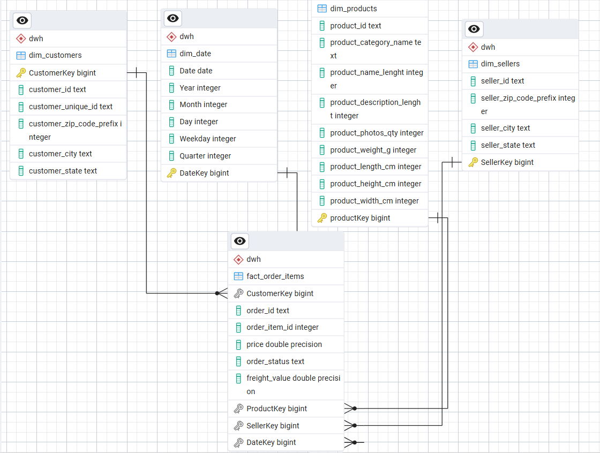

# 🛒 Olist E-Commerce Data Warehouse — ETL Pipeline

Pipeline ETL مبني بـ **PySpark** يحوّل بيانات [Brazilian E-Commerce Public Dataset by Olist](https://www.kaggle.com/datasets/olistbr/brazilian-ecommerce) من ملفات CSV خام إلى **Star Schema** كامل مخزّن في **PostgreSQL**، جاهز للتحليل والتقارير.

---

## 📌 نظرة عامة

البيانات الأصلية من Olist — أكبر متجر إلكتروني جامع (marketplace) في البرازيل — تغطي **~100,000 طلب** بين عامي 2016 و2018. هذا المشروع يحوّلها إلى **Data Warehouse** منظم بنمط **Star Schema**، باستخدام:

- **PySpark** لمعالجة وتحويل البيانات (Extract → Transform)
- **PostgreSQL** كقاعدة بيانات وجهة (Load)
- **psycopg2** للتحكم اليدوي بعمليات `TRUNCATE` حول قيود Foreign Key

المشروع مقسّم إلى أربع وحدات مستقلة المسؤولية (`extract.py`, `transform.py`, `load.py`)، ينسّقها ملف دخول واحد (`main.py`).

---

## 🗂️ مخطط قاعدة البيانات (ERD)

المخطط أعلاه — المُصدَّر مباشرة من **pgAdmin ERD Tool** بعد تنفيذ الـ pipeline — يوضّح بنية **Star Schema** الفعلية بقاعدة البيانات: جدول الحقائق `fact_order_items` في المنتصف، مرتبط بأربعة أبعاد (`dim_customers`, `dim_products`, `dim_sellers`, `dim_date`) عبر علاقات **One-to-Many** محمية بقيود **Foreign Key** فعلية.

---

## 🏗️ بنية الـ Data Warehouse (Star Schema)